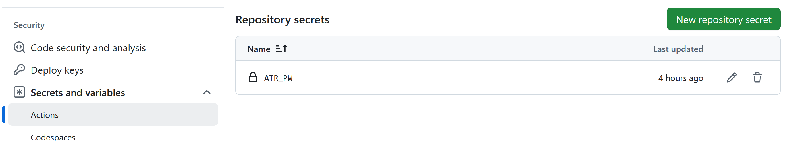

Last Updated on 2024-09-26

# Prot papers bot


This is the bot for
[@protpapers.bsky.social](https://bsky.app/profile/protpapers.bsky.social)
that was inspired and developed from bots created by
https://github.com/roblanf/phypapers and
https://github.com/JBGruber/r-bloggers-bluesky.

The bot runs twice a day to post new papers from PubMed and bioRxiv for
subjects that are of interest to me, namely HLA immunopeptidomics,
neoantigens and HDX-MS.

It’s written in R and uses Github Actions and YML file with `cron` to
run workflow.

Here’s what I did if you want to make your own. There’s probably ways to
make it better.

## 1. Set-up Bluesky

Follow these instructions from the `phypapers`
[readme](https://github.com/roblanf/phypapers):

<em> “Obviously you need an account to post to. This part gets you set
up on Bluesky, whether you have an existing personal account or not.

If you don’t have a Bluesky account: Go to https://bsky.app/, and click
‘Sign Up’ If you do have a Bluesky account, log in then go to Settings
and click Add Account Leave the hosting provider as Bluesky Social Fill
out your details to set up your new account: Protip: If you already use
your gmail address for your account, you can just append to it to create
a new account. E.g. if your personal account is
porcelain.crab@gmail.com, you could use
porcelain.crab+phypapers@gmail.com (the ‘+’ stays). This helps keep mail
separate. Decide on a handle. Following flypapers’ lead, I suggest a
short prefix followed immediately by papers, e.g. flypapers, phypapers,
etc. This means we all know it when we see a literature bot. Click on
your new profile, go to Edit Profile Username: I suggest making this
prefix_papers e.g. fly_papers or phy_papers. As above, this helps
everyone know what’s a literature bot Description: pretty obvious, but
it’s always nice to know the human who runs it, so good to put your name
there if you want to. It would be great if you could also put a link to
these instructions on your literature bot - that way anyone who sees
yours can also make their own. On my profile I just wrote: “Make your
own literature bot with these instructions:
https://github.com/roblanf/phypapers.” </em>

There’s another step to set-up and get the app password and token, but
we do that with the `atrrr` package:
https://jbgruber.github.io/atrrr/index.html later on.

## RSS feeds

For the RSS feeds I played around with the searches on PubMed and
bioRxiv until I got something reasonable.

### PubMed

I followed the `phypapers`
[readme](https://github.com/roblanf/phypapers) again:

<em>

1\. Go here: <http://www.ncbi.nlm.nih.gov/pubmed/>

2\. Type in your favourite search terms remembering that wildcards are
useful (e.g. `phylogen*` will match anything starting with `phylogen`,
and logical operators can be really good, e.g. you can have
`phylogen* OR raxml OR splitstree`.

3\. Click `search`

4\. Click the `Create RSS` link just below the search box

5\. Name is something sensible

6\. Set `Number of items to be displayed` to 100 7. Click `Create RSS`
8. Record the RSS URL somewhere

</em>

The somewhere bit for me is a character vector in R in `bot.R`.

After a bit of trial and error I ended up using search terms with flags
for the title and abstract:

`immunopeptidom*[tiab]`, `hdx-ms[tiab]`,
`immunopeptidom*[tiab] AND neoantigen*[tiab]`.

### bioRxiv

The full list of bioRxiv RSS feeds can be found on [biorxiv
alertsrss](https://www.biorxiv.org/alertsrss) but you can see the ones I
used in `bot.R` as a character vector.

``` r
# Vector of feeds of possible interest from bioRxiv, yields the last 30 days
brv_feeds <- c("http://connect.biorxiv.org/biorxiv_xml.php?subject=biochemistry",
               "http://connect.biorxiv.org/biorxiv_xml.php?subject=bioinformatics",
               "http://connect.biorxiv.org/biorxiv_xml.php?subject=biophysics",
               "http://connect.biorxiv.org/biorxiv_xml.php?subject=cancer_biology",
               "http://connect.biorxiv.org/biorxiv_xml.php?subject=cell_biology",
               "http://connect.biorxiv.org/biorxiv_xml.php?subject=developmental_biology",
               "http://connect.biorxiv.org/biorxiv_xml.php?subject=genetics",
               "http://connect.biorxiv.org/biorxiv_xml.php?subject=genomics",
               "http://connect.biorxiv.org/biorxiv_xml.php?subject=immunology",
               "http://connect.biorxiv.org/biorxiv_xml.php?subject=microbiology",
               "http://connect.biorxiv.org/biorxiv_xml.php?subject=molecular_biology",
               "http://connect.biorxiv.org/biorxiv_xml.php?subject=neuroscience",
               "http://connect.biorxiv.org/biorxiv_xml.php?subject=pharmacology",
               "http://connect.biorxiv.org/biorxiv_xml.php?subject=physiology",
               "http://connect.biorxiv.org/biorxiv_xml.php?subject=synthetic_biology",
               "http://connect.biorxiv.org/biorxiv_xml.php?subject=systems_biology")
```

Unlike PubMed the feeds provide all the papers the last 30 days and then
have to filter them for your interests. I did this using `stringr` and a
regex in `bot.R` like so:

``` r
brv_filt <- brv |> 
  filter(str_detect(item_title, "[Ii]mmunopep*|[Pp]eptidomi*|[Pp]eptidome|HDX-MS|([Pp]roteogenomics & [Nn]eoantigen)") |
         str_detect(item_description, "[Ii]mmunopep*|[Pp]eptidomi*|[Pp]eptidome|HDX-MS|([Pp]roteogenomics & [Nn]eoantigen)")) |> 
  mutate(link = str_extract(item_link,"^.*?[^?]*"))
```

## Adapt the R script

The R script is based on the instructions in the post: [R bloggers
Bluesky bot using
atrrr](https://www.johannesbgruber.eu/post/2024-01-18-building-r-bloggers-bluesky-bot-with-atrrr/)
and uses [`tidyrss`](https://robertmyles.github.io/tidyRSS/) to read the
RSS feeds.

You’ll need to install the packages and then adapt the script
accordingly.

When you get to part 3 of the script, you need to run the function
`auth()` from `atrrr` with the Bluesky name of the account you set-up in
Part 1 and follow the prompts to get the app password that you will save
for Bluesky authentication.

So for example I ran:

``` r
auth("protpapers.bsky.social")
```

This opens Bluesky and in settings I went to App Password, clicked Add
App Password which created a random *name* for the password
(e.g. PrussianBlue) and then I clicked to Create App Password to
actually get the password associated with the name.

Paste the password back into the prompt in R and also save it in your
`.REnviron` like so

Open `.Renviron` with the `usethis` package:

``` r
usethis::edit_r_environ()
```

Add the password like so:

``` r
ATR_PW="your-password-string"
```

The `BSKY_TOKEN` below was created when we used `auth()` and setting it
here saves it to the `papers_token.rds` file. But you can call this
whatever you want.

`ATR_PW` is then called into the environment like so:

``` r
Sys.setenv(BSKY_TOKEN = "papers_token.rds")
pw <- Sys.getenv("ATR_PW")

auth(user = "protpapers.bsky.social",
     password = pw,
     overwrite = TRUE)
```

You can always run `auth()` again and created a new password and token
in the future if you are have problems.

**Make sure your `.gitignore` is set not to upload files with passwords
or other sensitive information e.g. your `.Renivron` file.**

You can test the `bot.R` script first without deploying `bot.yml` on
Github.

## Adapt the YML for Github Workflow

To automate the bot you need to set-up a Github Action using the
`bot.yml`.

The `bot.yml` script should work as-is as long as it’s in the
`.github/workflows/` folder.

I’ve set it run twice a day at 0525 and 1725 UTC (Github runs on UTC),
but if you want to change the `cron` job, <https://crontab.guru> will
help you with `cron` syntax.

With help from Claude, I’ve revised the `.yml` to speed it up using
caching for system requirements and R packages. It should also catch
errors and report them as log files too. Bot runtime is now about 1 min.
45 seconds.

It uses [renv](https://rstudio.github.io/renv/articles/renv.html) for
caching and I created a GitHub Personal Access Token (PAT) for any parts
that require authentication including R package installation.

To create a GitHub PAT:

-   Go to your GitHub account settings
-   Navigate to “Developer settings” \> “Personal access tokens” \>
    “Tokens (classic)”
-   Click “Generate new token”
-   Give it a descriptive name and select the necessary scopes
    (typically repo for full repository access)
-   Copy the generated token

Add the PAT as a secret in the bot repository to Github as repository
secret in Settings \> Security \> Secrets and variables \> Actions like
so:

-   Name it `GH_PAT` and paste your token as the value
-   Likewise we need to add the password as a secret called `ATR_PW`



Everytime you push an update to Github, this will also trigger the
workflow, otherwise it will run according to the `cron` times. Click on
Actions at the top of your repo to see pending workflows.

[@jbgruber.bsky.social](https://bsky.app/profile/jbgruber.bsky.social)
added a Keep Alive job by https://github.com/gautamkrishnar, to the YML
to prevent Github disabling the botif no commits are made to the repo
after 60 days:
https://github.com/marketplace/actions/keepalive-workflow.
